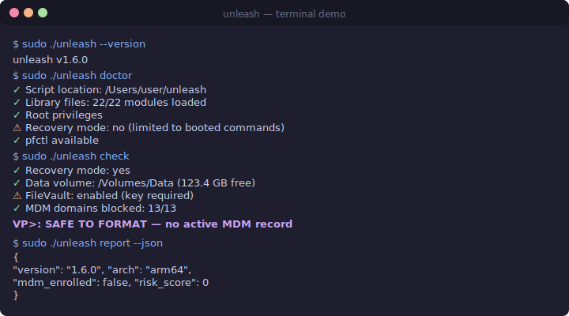

<p align="center">
  
  <br>
  <strong>unleash</strong>
  <br>
  <em>Single-script MDM bypass for macOS</em>
</p>

<p align="center">
  <a href="#install">Install</a> ·
  <a href="#quick-start">Quick Start</a> ·
  <a href="#commands">Commands</a> ·
  <a href="#how-it-works">How It Works</a> ·
  <a href="#troubleshooting">Troubleshooting</a>
</p>

---

unleash replaces the original five bypass-mdm scripts with a single file that handles every layer of Apple's MDM enrollment: DEP markers, network blocking, daemon overrides, user-level artifacts, and kernel-level firewall. Works from Recovery mode on Apple Silicon and Intel.

---

## Install

**Homebrew (easiest)**
```bash
brew install mateussiqueira/unleash/unleash
```

**Direct download**
```bash
curl -L https://raw.githubusercontent.com/mateussiqueira/unleash/main/unleash-standalone.sh -o unleash
chmod +x unleash
```

**From a USB drive (for Recovery mode)**
1. Format a USB/SSD as FAT32, APFS, or exFAT
2. Copy the `unleash` folder (or just `unleash-standalone.sh`) to the drive
3. Boot to Recovery and run from `/Volumes/YourDrive/unleash`

---

## Quick Start

### Recovery mode (standard bypass)

1. Boot to Recovery:
   - **Apple Silicon**: hold power button → Options → Continue
   - **Intel**: Cmd+R on startup

2. Open Terminal (Utilities → Terminal)

3. Run:
   ```bash
   "/Volumes/YourDrive/unleash" bypass
   ```

4. Follow the prompts to create a temporary admin user

5. Reboot. MDM enrollment will be suppressed.

### Booted system (already set up)

If you already have a Mac that was previously bypassed and MDM came back after an update:

```bash
sudo ./unleash heal
```

Or to check your current status:

```bash
sudo ./unleash status -d
```

---

## Commands

### Bypass & suppress

| Command | Description | Recovery | Booted |
|---------|-------------|----------|--------|
| `bypass` | Full bypass: create admin user + suppress MDM | ✓ | ✗ |
| `suppress` | Suppress enrollment without creating a user | ✓ | ✓ |
| `heal` | Re-apply suppression after macOS updates | ✓ | ✓ |
| `persist` | Install LaunchDaemon for auto-heal on every boot | ✓ | ✓ |
| `unpersist` | Remove the auto-heal LaunchDaemon | ✗ | ✓ |

### Firewall & hardening

| Command | Description |
|---------|-------------|
| `firewall` | Block Apple MDM IP ranges via pf (DoH-proof, kernel-level) |
| `firewall-off` | Remove pf firewall MDM block |
| `whitelist` | Block MDM domains only, keep iCloud/App Store working |
| `harden` | Kill MDM processes, remove profiles, flush DNS — from the booted system |

### Diagnostics

| Command | Description |
|---------|-------------|
| `audit` | Deep MDM scan — profiles, certificates, launch agents, risk score |
| `check` | Pre-format / pre-upgrade assessment — will this Mac lock after wipe? |
| `doctor` | Pre-flight diagnostics — root, Recovery, libs, disk, dependencies |
| `status` | MDM enrollment status (use `-d` for deep mode) |
| `report` | Full system report in human-readable or JSON format |

### Monitoring

| Command | Description |
|---------|-------------|
| `monitor` | Watch MDM state every 5 minutes, auto-heal if needed |
| `monitor-stop` | Stop the background monitor |
| `monitor-status` | Check if the monitor is running |
| `monitor-install` | Install monitor as a LaunchDaemon |

### VPN kill-switch

| Command | Description |
|---------|-------------|
| `vpn-kill` | Install pf kill-switch — blocks MDM outside the VPN tunnel |
| `vpn-kill-remove` | Remove the VPN kill-switch |
| `vpn-kill-status` | Check VPN kill-switch state |

### Utilities

| Command | Description |
|---------|-------------|
| `update` | Self-update from the latest GitHub release |
| `uninstall` | Complete removal with safety prompts |
| `reinstall` | Uninstall + install (atomic update) |
| `config` | View or edit persistent settings in `~/.unleash.conf` |
| `backup` | Save current state for later restore |
| `restore` | Restore from a previous backup |
| `demo` | Simulated bypass flow — no real changes |
| `test` | Dry-run simulation of any command |
| `dualboot` | Target an external or dual-boot volume |
| `init` | Interactive setup wizard |
| `suggest` | Risk-based system analysis and recommendations |
| `remediate` | Per-org MDM cleanup (JAMF, Mosyle, Kandji) |
| `predict` | Serial number lookup — predict org enrollment |
| `telemetry` | Manage anonymous usage stats (opt-in) |
| `discord-bot` | Start Discord DM alert bot |

### Aliases

Every command has a short alias:

```
by   = bypass       fw  = firewall     fw-off = firewall-off
sv   = suppress     mn  = monitor       doc   = doctor
st   = status       up  = update        uni   = uninstall
rei  = reinstall    vk  = vpn-kill      vkr   = vpn-kill-remove
vks  = vpn-kill-status
```

---

## How It Works

MDM (Mobile Device Management) operates in four layers on macOS. Unleash blocks every layer:

### Layer 1: DEP enrollment markers

In `/var/db/ConfigurationProfiles/Settings/`, Apple stores `.cloudConfig*` files that flag the Mac as DEP-enrolled. Removing these is the standard bypass approach, but macOS can recreate them from cached data.

**What unleash does**: Removes all `.cloudConfig*` markers, creates decoy files that tell macOS the device was never enrolled, and prevents re-creation by also blocking the network layer.

### Layer 2: Network blocking

The MDM enrollment process phones home to Apple's servers. Blocking these domains prevents the device from checking in.

**What unleash does**:
- **`/etc/hosts`** (basic): Blocks 13+ Apple MDM domains including `deviceenrollment.apple.com`, `mdmenrollment.apple.com`, `iprofiles.apple.com`. Can be bypassed by DNS-over-HTTPS.
- **pf firewall** (advanced): Kernel-level packet filtering that blocks MDM IP ranges even when DoH is used. Installed via `firewall` command.

### Layer 3: Daemon overrides

macOS ships with enrollment daemons (`ManagedClient.enroll`, `activationd`) that trigger enrollment on boot. Disabling these prevents automatic MDM checks.

**What unleash does**: Creates `launchd` disabled plists for 4 enrollment-related daemons, preventing them from starting.

### Layer 4: User-level artifacts

Migration Assistant and user login caches leave MDM enrollment data in `/Users/*/Library/Preferences/` and `/Users/*/Library/Caches/`. This is the #1 reason MDM comes back after a successful bypass.

**What unleash does**: Scans every user's Library directory and removes `com.apple.mdm.plist`, `com.apple.mdmclient.plist`, and `com.apple.enrollmenttool` cache.

---

## Troubleshooting

### MDM returns after reboot

The most likely cause is user-level artifacts. Run from Recovery:
```bash
sudo ./unleash suppress
```
Or from a booted system:
```bash
sudo ./unleash harden
```

### "Not a known DirStatus" error

The script auto-detects volume names, but if you have a non-standard setup:
1. Run `diskutil list` to find your Data volume
2. Mount it: `diskutil mount /dev/diskXsY`
3. Re-run unleash

### Profiles still shows enrollment

This is cosmetic. macOS stores profile state on the read-only SSV (System Sealed Volume). Check the actual DEP markers instead:
```bash
sudo ./unleash status -d
```

### FileVault is enabled

Unleash will detect FileVault and prompt for the recovery key or volume password. If automatic unlock fails, unlock the volume manually in Disk Utility first.

### macOS update re-enabled MDM

Run `sudo ./unleash heal` after any macOS update. If you used `persist` before the update, it does this automatically on next boot.

### Monitor won't start

Check if it's already running (`monitor-status`), check permissions (needs root), and check logs at `/var/log/unleash-monitor.log`.

### Can I use iCloud after bypass?

Yes, but:
- The basic `/etc/hosts` block also blocks `albert.apple.com` (iCloud activation) and `gdmf.apple.com`
- Use the `whitelist` command instead of `firewall` to block only MDM domains and leave iCloud/App Store working
- Or manually remove those two lines from `/etc/hosts`

---

## Smart Features

### `suggest` — Risk-Based Recommendations

Reads your system state (DEP markers, hosts file, pf firewall, user artifacts, Configurator enrollment) and gives a risk score plus specific commands to run.

### `remediate` — Per-Org Cleanup

Some MDM vendors (JAMF, Mosyle, Addigy, Kandji, VMware) leave vendor-specific artifacts. `remediate` auto-detects the org and applies targeted cleanup — including extra DNS blocks for their management domains.

### `predict` — Serial Number Lookup

Enter a serial number and unleash checks known org prefixes to predict whether a Mac was enrolled by a specific organization. Useful for buying used Macs.

### `init` — Setup Wizard

Walks you through first-time setup: Migration Assistant scan, Configurator check, firewall enable, monitor install, persist install, and system backup. One command to go from zero to protected.

---

## Terminal Demo



---

## Links

- [GitHub Repository](https://github.com/mateussiqueira/unleash)
- [Full README](https://github.com/mateussiqueira/unleash/blob/main/README.md)
- [Quick Reference (QUICKSTART.md)](https://github.com/mateussiqueira/unleash/blob/main/QUICKSTART.md)
- [Changelog](https://github.com/mateussiqueira/unleash/blob/main/CHANGELOG.md)
- [Contributing](https://github.com/mateussiqueira/unleash/blob/main/CONTRIBUTING.md)
- [Code of Conduct](https://github.com/mateussiqueira/unleash/blob/main/CODE_OF_CONDUCT.md)
- [Security Policy](https://github.com/mateussiqueira/unleash/blob/main/SECURITY.md)
- [Discussions](https://github.com/mateussiqueira/unleash/discussions)
- [Report a Bug](https://github.com/mateussiqueira/unleash/issues/new?template=bug_report.md)
